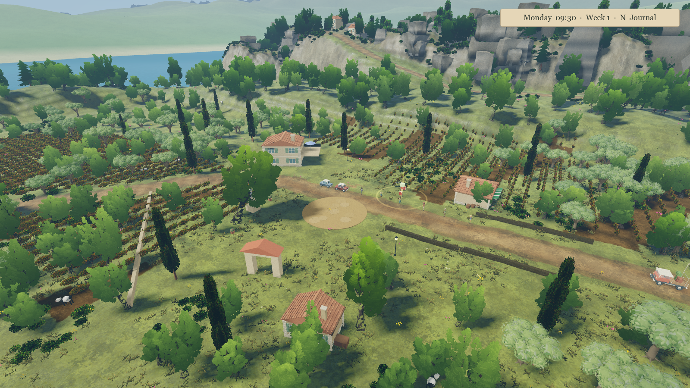
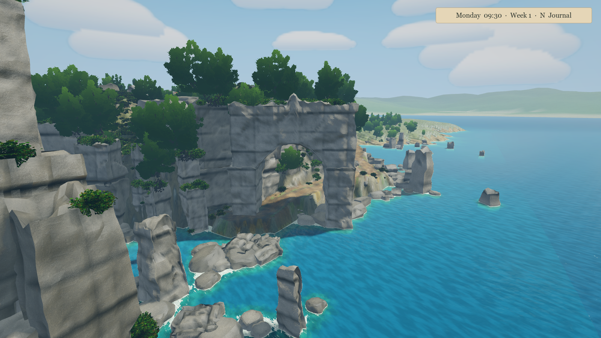
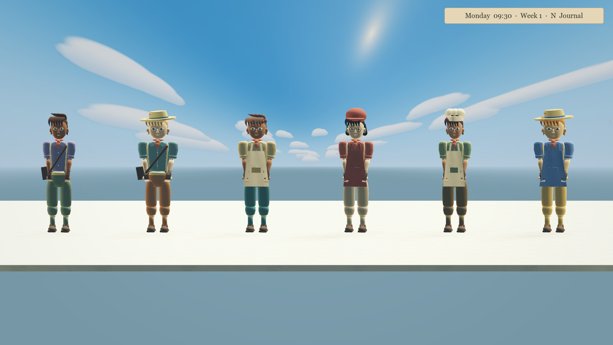

# September 2026 overhaul review

A broad playable overhaul implemented with a lead agent and three specialist agents, followed by independent adversarial reviews and corrective passes. ImageGen produced the actual gouache material surface, and Blender MCP authored/exported the truck, revised the palm, and processed every existing runtime GLB.

## What changed

- **World:** 25,000 m × 25,000 m boundary. The detailed 1,248 m core retains its original scale; a new north viaduct connects the original roads to surrounding highlands. Shared sampled terrain provides matching visuals, queries and streamed colliders. Terrain memory and the number of collision tiles are bounded.
- **Graphics:** bright summer sky, cream cloud banks, blue/turquoise water, sage/emerald foliage, gentler rock grain, generated gouache ground and object surfaces. All 20 pre-existing runtime GLBs were revised; 19 received material and vertex-paint passes, the palm received broader frond geometry and a new palette. A new rounded truck GLB replaces its procedural body. Most pre-existing mesh topology remains.
- **Characters:** all 64 records receive deterministic hair, proportions and occupation wardrobe variants. Hats, aprons, satchels and spectacles add silhouette variety while retaining the shared face and animated rig.
- **Controls:** separate bike/truck steering and throttle response, momentum-based walking, corrected analog input, coyote time, jump buffering, safe mount/dismount transitions, reverse braking and impact fixes.
- **AI/jobs:** explicit resident states, route failure/retry handling, scalable neighborhood traffic lookup, shared AStar autopilot routing, atomic delivery transitions, bounded saved receipt history and callback-safe persistence.

## Iteration and evidence

[World review](world-adversarial-review.md), [simulation review](simulation-review.md), [character review](character-review.md), and [vehicle art review](art-adversarial-review.md) describe independent findings and their fixes. These include a disconnected expansion, fallback collider gap, payout-save reentrancy, invalid character method naming, culled apron panels, cap intersections, truck part intersections and a 15 cm ground-contact error.

The atmosphere was rendered, revised after review, and rendered again. Two additional performance candidates were measured and rejected: shadow proxy nodes did not improve FPS, and halving shadow distance gave only a marginal gain. Production retains the better shadow coverage without the proxy complexity. Terrain albedo was subsequently changed to the generated paint texture. The screenshots below are actual Godot gameplay geometry, not generated concept art.

## Validation

Agent-run controls, riding-feel, feature and truck suites passed 97 assertions. Life, delivery, journey, architecture and dedicated world-expanse suites passed with zero failures. The truck and riding suites were rerun after collision-datum changes and passed another 46 assertions. The combined autopilot also completed two deliveries over 1,313 m in 91.7 simulation seconds. Editor import and GLB pivot checks passed. See [validation record](validation-summary.md). The asset audit records runtime GLB counts and exported COLOR_0 coverage.

See [world extent contract](world-extent-contract.md) for physical scale, landscape resolution and streaming limits, and `asset-audit.json` for GLB evidence. The generated asset, exact prompt and tool mode are documented in [assets/storybook/README.md](../../assets/storybook/README.md). Blender source is `assets/source/storybook_truck.blend`; generators are `tools/blender/storybook_truck.py`, `storybook_assets.py` and the revised `town_revision.py`. Original GLBs are archived locally in `original-models` so the paint pass is repeatable.

## Remaining quality gap

This is **not AAA signoff**, and it does not fulfill an every-asset bespoke remodelling target. Remote terrain is a coarse landscape with streamed dressing, not 625 km² of handcrafted content. Towns, residents and delivery destinations remain concentrated in the original core. Characters share one face/rig and rigid accessories; facial acting, bespoke pose/IK work, cloth motion and further mesh production are still needed. Existing photo source maps remain on disk for provenance and quiet normal relief. Audio and UI were not comprehensively replaced.

Passing tests establishes functional behavior, not artistic production quality. Performance measurements apply only to the recorded machine, renderer and sampled views. The initial fixed-camera benchmark measured 47.3 FPS in the village and 212.6 FPS in wilderness (M4 Pro, 1600×900, Compatibility, vsync off); see [methodology and results](performance-review.md).
