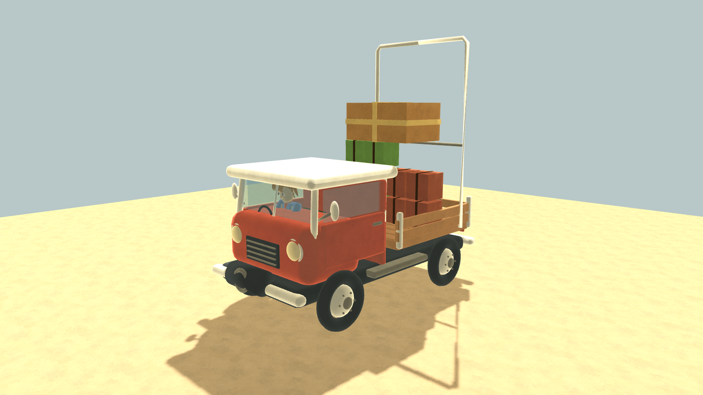
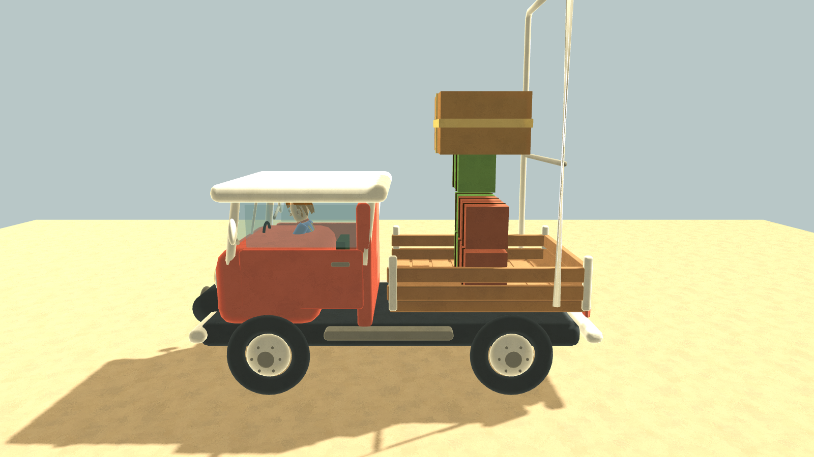
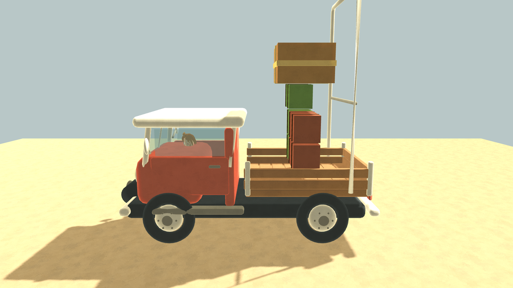
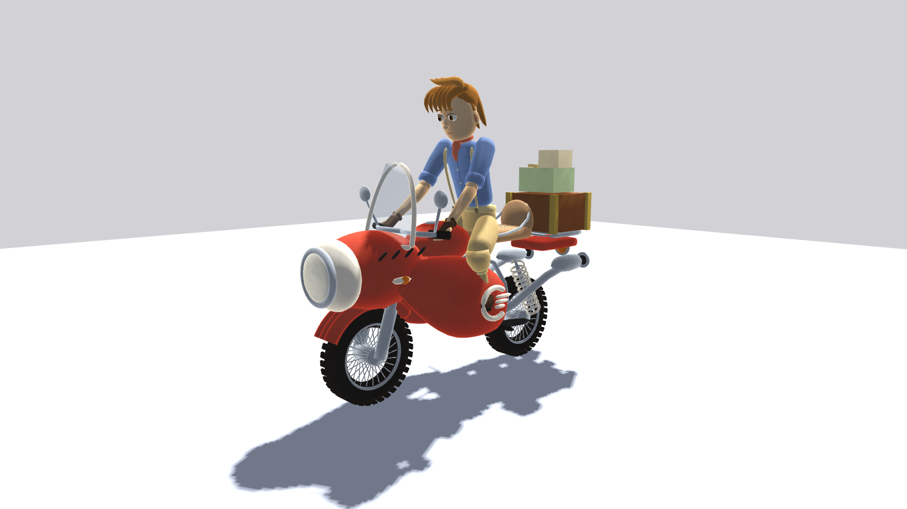

# Adversarial art review — actual Godot renders

The truck is a substantive new Blender model with rounded body panels, wood bed, transparent windows, detailed hubs and animated steering pivots. The existing bike and other GLBs received material/vertex-colour treatment; they are not all newly modelled assets. Residents have new garment and accessory geometry with deterministic proportions and hairstyles on a shared rig and face template. This is a visual upgrade, not demonstrated AAA graphics.

Reviewed captures used Godot 4.7 Compatibility rendering on Apple M4 Pro, 1600×900. Truck final views use the actual physical Truck entity settled on a collision pad, rather than a floating visual preview.

Fixed during adversarial iteration:

- RiderModel used the native Node3D.set_identity name with a conflicting signature and prevented both vehicle drivers from compiling. Renamed by the character agent, then recaptured.
- Truck running board crossed the front hub. Root shortened and moved the Blender board between the axles.
- Driver sat below dashboard sightline. Repositioned and resized driver, added seat cushions, raised the steering wheel, then lowered the revised driver slightly after a roof-clearance capture.
- Cargo rack originated 22 cm above the new bed. Moved its base to the actual bed surface.
- New zero-bottom tires sank 15.3 cm because the truck collider's floor datum was 15.5 cm above its origin. Aligned the collider bottom to the vehicle origin; measured settled wheel bottom is now +0.00135 m relative to the floor.
- First resident lineup faced backward and could not substantiate facial/garment quality. Character agent recaptured two larger frontal lineups, fixed apron front winding and hair penetrating cap crowns. Latest frontal captures reviewed after fixes.

Verification:

- Fresh Godot editor import completed without script/resource errors.
- Imported truck has four non-null wheel nodes and two non-null front steering pivots. Runtime spin changes preserve all wheel centers; steering pivots reach the expected 24 degrees.
- Windows remain transparent and driver is visible; shadows render in the Compatibility backend.
- Full truck gameplay (13 assertions) and riding-feel (33 assertions) suites PASS after collision-datum change. Isolated riding run retains pre-existing ObjectDB/resource shutdown warnings; no in-run script errors.

Remaining limitations:

- Character faces and segmented anatomy still share one base and have a toy-like appearance; accessories are not bespoke full-character sculpting or animation rigs.
- Bike rider lower legs/boots are obscured by the side fairings in this pose. Seated character fit needs bespoke pose/IK refinement.
- Cargo still uses visibly simple box cells and rigid stacking. Side viewer framing crops the very top of the tall rack; front view retains it.
- Surface grain and broad material changes cannot replace hand-authored mesh detail, facial animation, texture production and lighting direction across the entire game.
- Simple test-lighting shadows remain hard/aliased. These screenshots establish functional materials and fit, not a cinematic production-quality benchmark.

