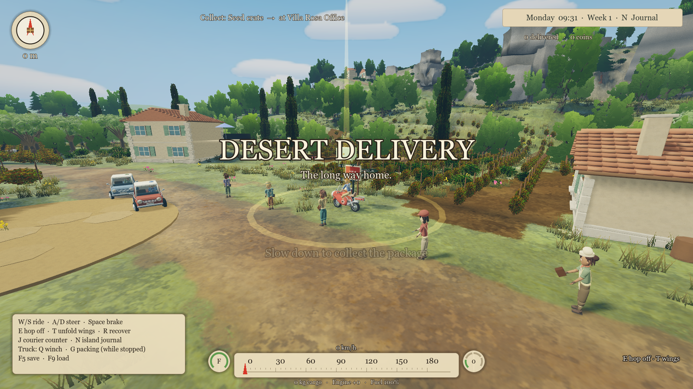
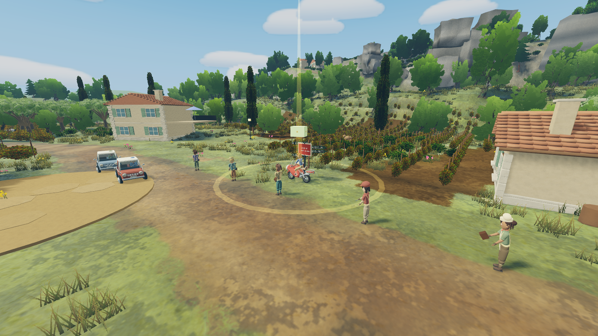

# Performance candidates — rejected after independent measurement

Final production rendering remains at the authored 320 m directional shadow distance. The experimental chunk detail/shadow-proxy code was fully removed. No distant geometry or canopies were discarded to improve the headline frame rate.

Independent reviewer: simulation agent. Measurements used the same 1600×900 Apple M4 Pro Compatibility renderer and fixed benchmark cameras, 120 warm-up frames and 300 measured frames per scene. See `benchmark.json`, the candidate benchmark directories, and `performance-review.md` for raw measurements and limitations.

| Village configuration | Average FPS | Median frame ms | p95 frame ms | Draw calls | Decision |
| --- | ---: | ---: | ---: | ---: | --- |
| Authored baseline, 320 m shadows | 47.32 | 20.912 | 22.442 | 4482.50 | Retained |
| Static small-detail ranges + shadow proxies | 47.34 | 21.206 | 22.841 | 4372.68 | Rejected; adds 301 nodes with no useful frame-time improvement |
| Original meshes, 160 m shadow distance | 48.49 | 20.730 | 22.327 | 3814.05 | Rejected; median/p95 improve less than 1%, sacrifice distant shadows |

The static-detail experiment affected only opaque meshes under streamed chunks; actor rigs, vehicle parts, cargo, interaction markers, transparent materials, shaders, and architecture/canopies were excluded. Its conservative submeter mesh ranges and 80 m small-object shadow proxies cut only 2.45% of draw calls, while increasing scene-node overhead. The next experiment halved the actual authored shadow distance from 320 m to 160 m, reducing calls by 14.9% but producing practically flat frame times. Neither achieved a credible 60 FPS result, much less AAA performance certification. Source was preserved rather than retaining unproven complexity or a visual downgrade.

The diagnostic profile disproved the original tiny-prop assumption: only 16 static camera-frustum candidate surfaces were under 0.5 m, while hundreds of larger distant rock/LOD surfaces were present. Candidate counts include both LODs and are not actual GPU draw counts. The throwaway profiling script was removed; the reusable `tests/overhaul_benchmark.gd` remains.

The images below document the static-detail candidate's preserved village silhouettes and foreground. This is a qualitative inspection, not a pixel-difference test: the earlier screenshot includes startup HUD/title overlays; the later capture hides CanvasLayers, and resident animation advances independently. No 160 m shadow screenshot was used to justify retention because that candidate was rejected on measured benefit alone.

